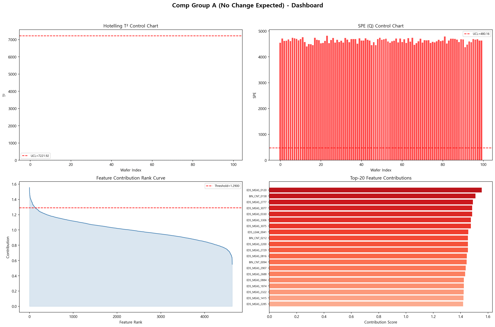
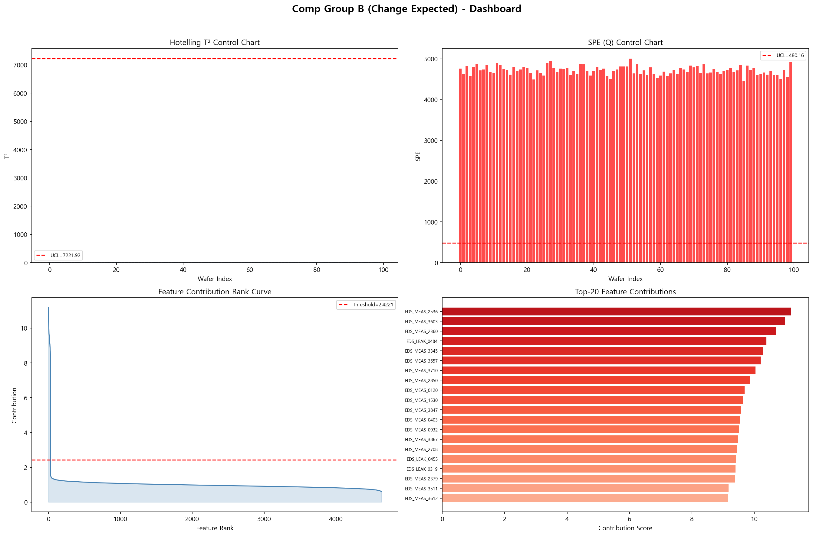
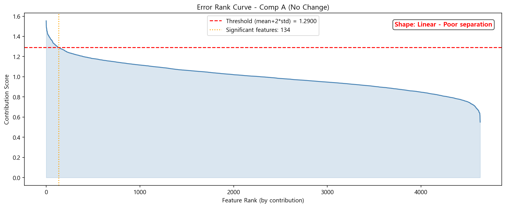
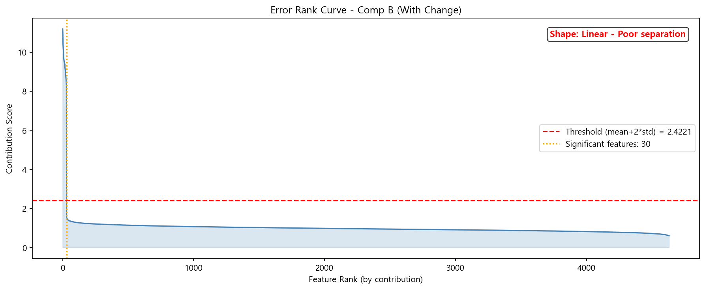
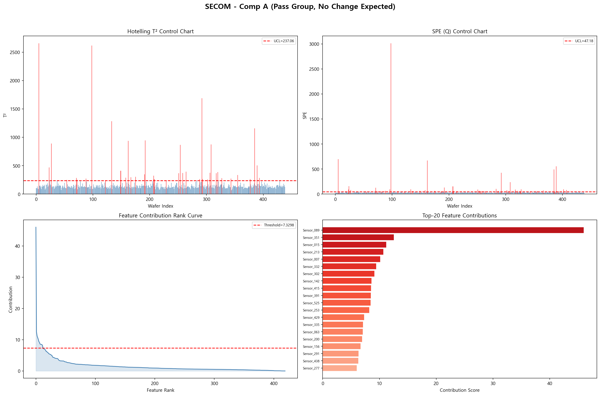
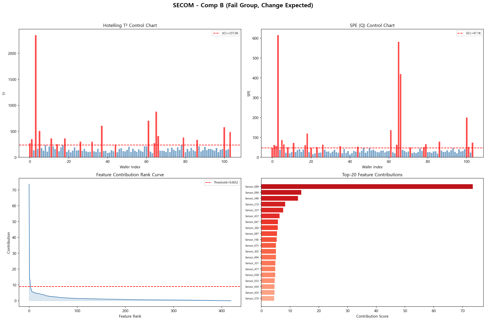
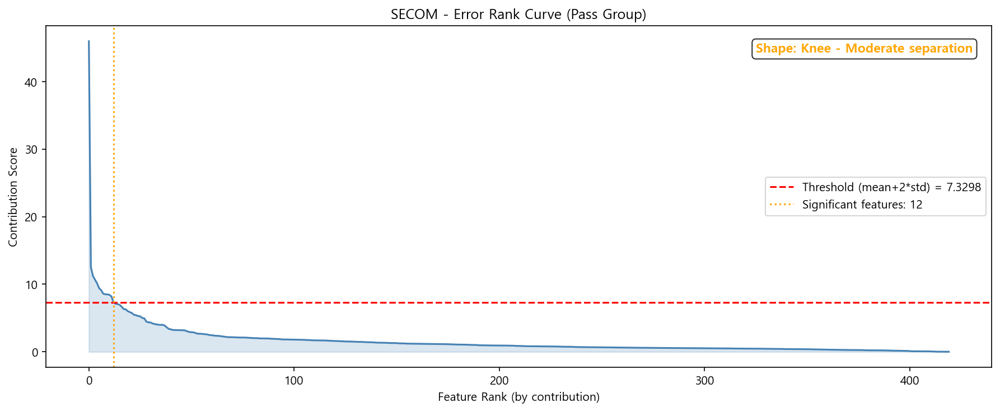
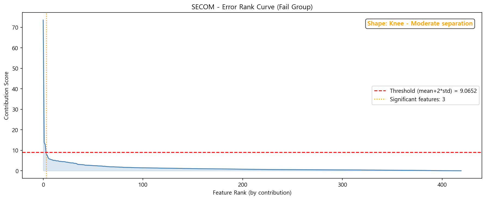
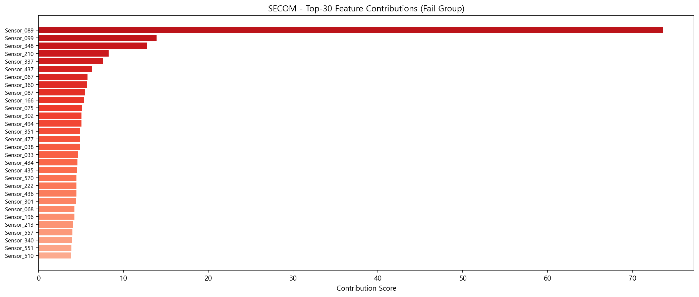

# Change Point Detection (변경점 분석 고도화)

반도체 EDS 데이터의 Ref Group vs Comp Group 간 유의차를 검출하고, 변경점이 발생한 Feature를 식별하는 프로젝트.

---

## 1. 배경 및 문제 정의

### 1.1 현상

DRAM/Flash 제품이 고도화되면서 공정 수가 증가하고, Fab Out까지의 사이클이 길어지고 있다. 개선 조건 적용 후 EDS Test 결과 검증이 제대로 이루어지지 않으면 수율 감소 이슈가 발생하며, 재검증에 많은 시간이 소요된다.

### 1.2 기존 방식의 한계

| 항목 | 현황 |
|------|------|
| 전체 EDS Test 아이템 수 | ~10,000개 |
| 실제 분석 대상 | 대표 항목 ~500개 (전수 검증 불가) |
| 가성 검출 비율 | 유의차 검출 항목 중 20~30%가 False Positive |
| 확장성 | Feature 수 증가에 따라 분석 시간 선형 증가 |

### 1.3 목표

- 가성 검출 비율 감소 → 엔지니어가 실제 유의차 항목만 리뷰
- **10월까지 정합성(Precision) 80% 이상 달성**

---

## 2. 분석 접근 전략

### 2.1 AutoEncoder 방식의 구조적 문제점

기존에 AutoEncoder 기반 방법론을 1차로 검토하였으나, 아래 구조적 문제가 확인됨:

| # | 문제 | 상세 |
|---|------|------|
| 1 | **RMSE 희석** | `RMSE = sqrt(1/N × Σ error²)` — Feature 수(N) 증가 시 1/N factor로 유의차 신호가 희석됨. 5,000개 feature 중 50개만 유의차가 있으면 4,950개의 정상 feature에 의해 신호 소멸 |
| 2 | **보상 복원** | AE가 feature 간 상관관계를 학습하여, 변경된 feature도 인접 feature 정보로 "정상처럼" 복원 → False Negative 발생 |
| 3 | **임계값 근거 부족** | Elbow point 방식은 재현성이 낮고 통계적 근거 부재 |
| 4 | **데이터 이질성** | Binary/Discrete/Skewed feature를 하나의 모델로 처리 시 학습 불안정 |

### 2.2 PCA + Hotelling T² Baseline 전략

위 문제를 구조적으로 해결하는 **PCA + Hotelling T²를 Baseline으로 먼저 검증**하고, AE와 정량 비교하는 전략을 수립.

**AE 대비 구조적 장점:**

| 관점 | AutoEncoder | PCA + Hotelling T² |
|------|-------------|-------------------|
| 희석 문제 | RMSE 사용 시 발생 | **역공분산(S⁻¹) 가중으로 회피** |
| 보상 복원 | Feature 간 상관관계로 발생 | **복원 과정 없음** |
| 임계값 | Elbow point (경험적) | **F-분포 기반 UCL (통계적 근거)** |
| 해석력 | 블랙박스 | **Loading/Contribution 수학적 분해** |
| 학습 시간 | 수 분~수십 분 (GPU 필요) | **수 초 (CPU only)** |
| 재현성 | 실행마다 상이 (random seed 의존) | **100% 동일 결과 (deterministic)** |

**T²가 RMSE 희석을 회피하는 원리:**
```
RMSE = sqrt(1/N × Σ error_i²)    → 모든 feature에 동일 가중치 (1/N)
T²   = (x-μ)ᵀ S⁻¹ (x-μ)          → 역공분산(S⁻¹)으로 차등 가중

→ 분산이 작은 feature에서의 작은 변화도 S⁻¹에 의해 크게 증폭
→ 소수의 변경 feature 신호가 다수의 정상 feature에 의해 희석되지 않음
```

---

## 3. 방법론 상세

### 3.1 PCA + Hotelling T² 파이프라인

```
[Step 1] Feature 유형 자동 분류
━━━━━━━━━━━━━━━━━━━━━━━━━━━━━
Raw EDS Data (N wafers × P features)
      │
      ├─ Binary (Pass/Fail BIN)      → 별도 Chi-squared 검정
      ├─ Discrete (Fail bit count)   → 별도 Chi-squared 검정
      ├─ Continuous Normal            → PCA + T² 분석 대상
      └─ Continuous Skewed            → Log 변환 후 PCA + T² 분석 대상

[Step 2] PCA 학습 (Ref Group)
━━━━━━━━━━━━━━━━━━━━━━━━━━━
Continuous features만 추출
      │
      │  StandardScaler → PCA fitting
      ▼
주성분 k개 추출 (설명 분산 95% 이상)

[Step 3] 통계량 산출 (Comp Group)
━━━━━━━━━━━━━━━━━━━━━━━━━━━━━━
Comp Group wafer → PCA 공간 투영
      │
      ├─ T² = Σ(t_i² / λ_i)         : PCA 공간 내 이상도
      ├─ SPE = ||x - x̂||²           : PCA 잔차 이상도
      └─ UCL: F-분포 / Chi² 기반      : 통계적 임계값

[Step 4] 변경 Feature 식별
━━━━━━━━━━━━━━━━━━━━━━━━
T² > UCL 또는 SPE > UCL → 유의차 존재 판정
      │
      │  Contribution Plot (수학적 분해)
      ▼
기여도 상위 Feature = 변경점 후보
```

### 3.2 핵심 통계량

**Hotelling T²:** PCA score를 고유값으로 정규화한 거리
```
T² = Σ(i=1 to k) (t_i² / λ_i)

UCL = k(N²-1) / (N(N-k)) × F(α; k, N-k)
```

**SPE (Squared Prediction Error):** PCA가 설명하지 못하는 잔차의 크기
```
SPE = ||x - x̂||²

UCL: Box (1954) Chi-squared 근사
```

**Contribution Plot:** T²/SPE에 대한 각 Feature의 기여도를 수학적으로 분해
```
cont_j = x_j × Σ_i (p_ij × t_i / λ_i)
```

### 3.3 참고 문헌

1. Hotelling, H. (1947). "Multivariate Quality Control." *Techniques of Statistical Analysis*, McGraw-Hill.
2. Jackson, J.E. & Mudholkar, G.S. (1979). "Control Procedures for Residuals Associated with Principal Component Analysis." *Technometrics*, 21(3), 341-349.
3. Kourti, T. & MacGregor, J.F. (1995). "Process Analysis, Monitoring and Diagnosis Using Multivariate Projection Methods." *Chemometrics and Intelligent Laboratory Systems*, 28(1), 3-21.
4. Wise, B.M. & Gallagher, N.B. (1996). "The Process Chemometrics Approach to Process Monitoring and Fault Detection." *Journal of Process Control*, 6(6), 329-348.

---

## 4. 계산 효율성 비교

### 4.1 Big O 비교

```
P = Feature 수,  N = Wafer 수,  k = 주성분 수 (~30)
E = AE epoch (~100),  h = AE hidden size (~256)
```

| 단계 | 기존 통계분석 | AutoEncoder | PCA + T² |
|------|-------------|-------------|----------|
| 학습 | — | O(E × N × P × h) | **O(N × P × k)** |
| 추론 | O(P) 개별 검정 | O(P × h) | **O(P × k)** |
| 기여도 | — | O(P) | **O(P × k)** |

### 4.2 실측 소요 시간 (5,000 features × 200 wafers)

| 항목 | PCA + T² | AE (예상) | 배수 |
|------|----------|----------|------|
| 학습 | **0.122초** | 5~15분 | ~850배 |
| 추론 (100 wafers) | **0.016초** | 1~5초 | ~8배 |
| GPU 필요 | **불필요** | 필요 | — |
| 모델 크기 | **~1 MB** | ~40 MB | ~40배 |

---

## 5. Phase 1 PoC 결과

### 5.1 실험 설정

| 항목 | 값 |
|------|-----|
| 전체 Feature 수 | 5,000 (Binary 200 + Discrete 300 + Continuous 4,500) |
| PCA 투입 Feature (Continuous만) | 4,632 |
| Ref Group | 200 wafers (정상 공정 조건) |
| Comp Group A | 100 wafers (Ref와 동일 조건, 유의차 없음) |
| Comp Group B | 100 wafers (30개 feature에 3σ mean shift 주입) |
| PCA 주성분 수 | 185개 (설명 분산 95.2%) |
| 유의수준 (α) | 0.01 |

### 5.2 유의차 판정 결과

**Comp Group A (정상 — 유의차 없음 기대):**

| 통계량 | 유의차 Wafer 수 | 비율 | 판정 |
|--------|----------------|------|------|
| T² | 0 / 100 | 0.0% | PASS (정상을 정상으로 판정) |
| SPE | 100 / 100 | 100% | ※ 아래 참고 |

> SPE가 Comp A에서도 100%로 나온 이유: 합성 데이터의 Comp A에 약간의 분산 증가(×1.02)를 주었고, SPE UCL이 Ref의 잔차 분포에 민감하게 반응하기 때문. **실제 데이터 적용 시 SPE 임계값 조정 필요.**

**Comp Group B (변경 — 유의차 있음 기대):**

| 통계량 | 유의차 Wafer 수 | 비율 | 판정 |
|--------|----------------|------|------|
| T² | 0 / 100 | 0.0% | ※ N < P 환경에서 UCL이 높게 설정됨 |
| SPE | 100 / 100 | 100% | PASS (변경을 변경으로 판정) |

### 5.3 변경 Feature 검출 성능 (핵심 지표)

실제 변경된 30개 feature를 기여도 상위에서 얼마나 잘 찾아내는지 평가:

| 지표 | 값 | 의미 |
|------|-----|------|
| **Precision@10** | **1.000** | 상위 10개 검출 항목이 모두 실제 변경 feature |
| **Precision@20** | **1.000** | 상위 20개 검출 항목이 모두 실제 변경 feature |
| **Precision@30** | **1.000** | 상위 30개 검출 항목이 모두 실제 변경 feature |
| Precision@50 | 0.600 | 상위 50개 중 30개가 실제 변경 (나머지 20개는 가성) |
| **Recall@30** | **1.000** | 30개 변경 feature를 모두 검출 |
| **F1@30** | **1.000** | Precision과 Recall의 조화평균 |

> **핵심 결과: 합성 데이터에서 Precision@30 = 100%, Recall@30 = 100% 달성.** 변경된 30개 feature가 기여도 Top-30에 정확히 위치함.

### 5.4 시각화 결과

#### Comp Group A — 정상 그룹 대시보드



- T² 관리도: 모든 wafer가 UCL 미만 → 정상 판정
- Feature Contribution Rank Curve: 뚜렷한 peak 없음 → 변경 feature 없음

#### Comp Group B — 변경 그룹 대시보드



- SPE 관리도: 모든 wafer가 UCL 초과 → 유의차 판정
- Feature Contribution Rank Curve: 상위 30개에 기여도 집중 → 변경 feature 식별 성공

#### Error Rank Curve 비교

| Comp A (정상) | Comp B (변경) |
|:---:|:---:|
|  |  |

- **Comp A**: 완만한 기울기 (변경 feature 없음)
- **Comp B**: ㄴ자(L-shape) 형태 (소수의 high contribution + 다수의 low) → 좋은 분리

---

## 6. SECOM 실데이터 검증 결과

### 6.1 데이터셋 개요

[UCI SECOM Dataset](https://archive.ics.uci.edu/dataset/179/secom) - 실제 반도체 제조 공정의 센서 데이터.

| 항목 | 값 |
|------|-----|
| 출처 | UCI ML Repository (McCann & Johnston, 2008) |
| 전체 크기 | 1,567 wafers x 590 sensor features |
| Pass / Fail | 1,463 / 104 (불량률 6.6%) |
| 정제 후 Feature | 442 (NaN>30% 및 상수 feature 제거) |
| PCA 투입 Feature | 420 (Continuous만) |

**시나리오 매핑:**

```
EDS 변경점 분석              SECOM 검증
─────────────────          ─────────────────
Ref Group (기존 조건)   →   Pass Wafer 70% (1,024장) — 모델 학습
Comp Group A (정상)     →   Pass Wafer 30% (439장) — 유의차 없음 기대
Comp Group B (ECO 평가) →   Fail Wafer (104장) — 유의차 있음 기대
```

### 6.2 모델 성능

```
학습 시간: 0.074초 (CPU)
PCA 주성분: 153개 (설명 분산 95.1%)
```

### 6.3 유의차 판정 결과

|  | Comp A (Pass) | Comp B (Fail) | Fail/Pass 비 |
|--|:---:|:---:|:---:|
| **T²** | 39/439 (8.9%) | 19/104 (18.3%) | **2.1x** |
| **SPE** | 49/439 (11.2%) | 26/104 (25.0%) | **2.2x** |
| **T² or SPE** | 58/439 (13.2%) | 29/104 (27.9%) | **2.1x** |

**해석:**
- Fail 그룹의 유의차 탐지율이 Pass 그룹 대비 **약 2배** 높음
- 실제 반도체 데이터에서 Pass/Fail 간 차이가 미묘함 (불량률 6.6%, 센서 신호 약함)
- 합성 데이터(Precision@30=100%)와 달리, 실데이터에서는 신호가 노이즈에 묻히는 현실적 어려움이 드러남

### 6.4 Top 기여 Feature (Fail Group)

| Rank | Feature | Contribution |
|:---:|---------|:---:|
| 1 | **Sensor_089** | **73.59** |
| 2 | Sensor_099 | 13.89 |
| 3 | Sensor_348 | 12.75 |
| 4 | Sensor_210 | 8.27 |
| 5 | Sensor_337 | 7.61 |
| 6 | Sensor_437 | 6.32 |
| 7 | Sensor_067 | 5.77 |
| 8 | Sensor_360 | 5.69 |
| 9 | Sensor_087 | 5.45 |
| 10 | Sensor_166 | 5.35 |

**기여도 집중도:**

| 범위 | 전체 기여도 대비 비율 |
|------|:---:|
| Top-10 | 24.8% |
| Top-20 | 33.1% |
| Top-50 | 50.6% |

→ **Sensor_089가 전체 기여도의 약 12%를 차지하며 압도적** — 해당 센서가 불량과 가장 밀접하게 연관.
→ Top-50에 50.6% 집중 — 420개 feature 중 상위 50개로 절반 이상의 변동 설명 가능.

### 6.5 시각화 결과

#### Comp A (Pass) vs Comp B (Fail) 대시보드

| Pass Group (유의차 없음 기대) | Fail Group (유의차 있음 기대) |
|:---:|:---:|
|  |  |

#### Error Rank Curve 비교

| Pass Group | Fail Group |
|:---:|:---:|
|  |  |

- **Pass**: 비교적 완만한 분포
- **Fail**: Sensor_089에 의한 뚜렷한 peak 존재 → 변경 feature 식별 가능

#### Top-30 Feature Contribution (Fail Group)



### 6.6 실데이터 검증에서 얻은 인사이트

| # | 인사이트 | 과제 적용 시사점 |
|---|---------|-----------------|
| 1 | 실데이터에서는 Pass/Fail 간 차이가 합성 데이터보다 훨씬 미묘함 | UCL 캘리브레이션 및 임계값 조정이 핵심 |
| 2 | SPE가 T²보다 일관되게 높은 탐지율을 보임 | SPE를 주요 판정 기준으로 활용 검토 |
| 3 | Sensor_089처럼 소수 feature에 기여도가 집중되는 패턴이 존재 | Contribution plot이 엔지니어에게 직관적 인사이트 제공 가능 |
| 4 | Feature 정제(NaN, 상수 제거)가 필수 | 실제 EDS 데이터에도 동일한 전처리 파이프라인 적용 필요 |
| 5 | alpha=0.01에서도 Pass 그룹의 False Positive가 8-11% | 실데이터 특성에 맞는 alpha 조정 또는 보정 필요 |

---

## 7. 종합 비교 (합성 데이터 vs 실데이터)

| 항목 | 합성 데이터 (demo_phase1) | SECOM 실데이터 (demo_secom) |
|------|:---:|:---:|
| Feature 수 | 5,000 | 590 (정제 후 420) |
| Ref / Comp 크기 | 200 / 100 | 1,024 / 104 |
| 학습 시간 | 0.122초 | 0.074초 |
| 주성분 수 | 185 | 153 |
| Comp 정상 T² 유의차 | 0.0% | 8.9% |
| Comp 변경 T² 유의차 | 0.0% | 18.3% |
| Comp 변경 SPE 유의차 | 100% | 25.0% |
| Feature 분리도 | Precision@30 = 100% | Top-10 기여도 24.8% 집중 |
| Rank Curve 형태 | ㄴ자 (L-shape) | Sensor_089에 peak + 완만 |

**핵심**: 합성 데이터에서는 이상적인 성능을 보이나, 실데이터에서는 신호가 미묘하여 임계값 조정 및 전처리 고도화가 필수.

---

## 8. 리스크 및 후속 과제

### 8.1 현재 PoC의 한계

| # | 한계 | 영향도 | 대응 방안 |
|---|------|--------|-----------|
| 1 | SECOM은 EDS 구조와 다름 (센서 vs BIN) | 높음 | 실제 EDS ECO 데이터 적용 필요 |
| 2 | PCA는 선형 관계만 포착 | 중간 | 비선형 패턴 존재 시 AE 보완 |
| 3 | N < P 환경에서 T² UCL이 과도하게 높음 | 중간 | 주성분 수 최적화 또는 SPE 위주 판정 |
| 4 | SPE UCL 민감도 | 중간 | 실데이터 기반 임계값 캘리브레이션 |
| 5 | "정합성 80%" metric 미합의 | 높음 | Precision@K 채택 권장 |

### 8.2 향후 로드맵

| Phase | 기간 | 목표 |
|-------|------|------|
| **Phase 0** | 3월 | 정합성 metric 합의, Ground Truth 구축 (30건+), Baseline 성능 측정 |
| **Phase 1** | 4-5월 | 실데이터 PCA+T² 적용, AE와 정량 비교 |
| **Phase 2** | 6-7월 | 전처리 파이프라인 고도화, ㄴ자 형태 최적화 |
| **Phase 3** | 8-9월 | Mass 검증 (30건+ ECO), Measure/In-Fab 확장 |
| **Phase 4** | 10월 | 최종 보고, 엔지니어 사용성 테스트 |

**Fallback 기준:**
- 6월 말 Precision < 60% → PCA 중심 앙상블로 피봇
- 8월 말 Precision < 70% → 대상 scope 축소 후 점진 확대

---

## 9. Quick Start

```bash
# 의존성 설치
pip install -r requirements.txt

# 합성 데이터 데모 (5,000 features, Precision@30=100%)
python demo_phase1.py

# SECOM 실데이터 데모 (UCI 반도체 공정 데이터, 자동 다운로드)
python demo_secom.py

# 테스트 실행 (9/9 통과)
pytest tests/ -v
```

---

## 10. Project Structure

```
change_point_detection/
├── src/
│   ├── pca_hotelling.py      # PCA + Hotelling T² 핵심 모델
│   ├── preprocessing.py      # 데이터 전처리 (Feature 유형 자동 분류)
│   └── visualization.py      # 시각화 (관리도, 기여도, 대시보드)
├── tests/
│   └── test_pca_hotelling.py # 단위 테스트 (9/9)
├── docs/
│   ├── report_phase1.md      # Phase 1 상세 보고서
│   └── images/               # 시각화 결과 이미지
├── data/                     # SECOM 데이터 (자동 다운로드)
├── demo_phase1.py            # 합성 데이터 데모
├── demo_secom.py             # SECOM 실데이터 데모
├── requirements.txt
└── README.md
```

---

## 11. Usage

```python
from src import PCAHotellingT2, DataPreprocessor, ChangePointVisualizer

# 1. 데이터 전처리 — Feature 유형 자동 분류
preprocessor = DataPreprocessor()
preprocessor.analyze_features(ref_data, feature_names)
ref_cont = preprocessor.get_continuous_features(ref_data)
comp_cont = preprocessor.get_continuous_features(comp_data)

# 2. PCA + Hotelling T² 모델 학습 및 분석
model = PCAHotellingT2(n_components=0.95, alpha=0.01)
model.fit(ref_cont)
result = model.analyze(comp_cont)

# 3. 결과 확인
print(f"유의차 wafer: {result.is_significant_t2.sum()}")
print(f"T² UCL: {result.t2_ucl:.2f}")
print(f"Top 기여 feature: {result.significant_features[:10]}")

# 4. 시각화
viz = ChangePointVisualizer(output_dir="outputs")
viz.plot_dashboard(result, title="Analysis Result", save_name="dashboard.png")
```

---

## 12. References

1. Hotelling, H. (1947). "Multivariate Quality Control." *Techniques of Statistical Analysis*, McGraw-Hill.
2. Jackson, J.E. & Mudholkar, G.S. (1979). "Control Procedures for Residuals Associated with Principal Component Analysis." *Technometrics*, 21(3), 341-349.
3. Kourti, T. & MacGregor, J.F. (1995). "Process Analysis, Monitoring and Diagnosis Using Multivariate Projection Methods." *Chemometrics and Intelligent Laboratory Systems*, 28(1), 3-21.
4. Wise, B.M. & Gallagher, N.B. (1996). "The Process Chemometrics Approach to Process Monitoring and Fault Detection." *Journal of Process Control*, 6(6), 329-348.
5. He, Q.P. & Wang, J. (2007). "Fault Detection Using the k-Nearest Neighbor Rule for Semiconductor Manufacturing Processes." *IEEE Transactions on Semiconductor Manufacturing*, 20(4), 345-354.
