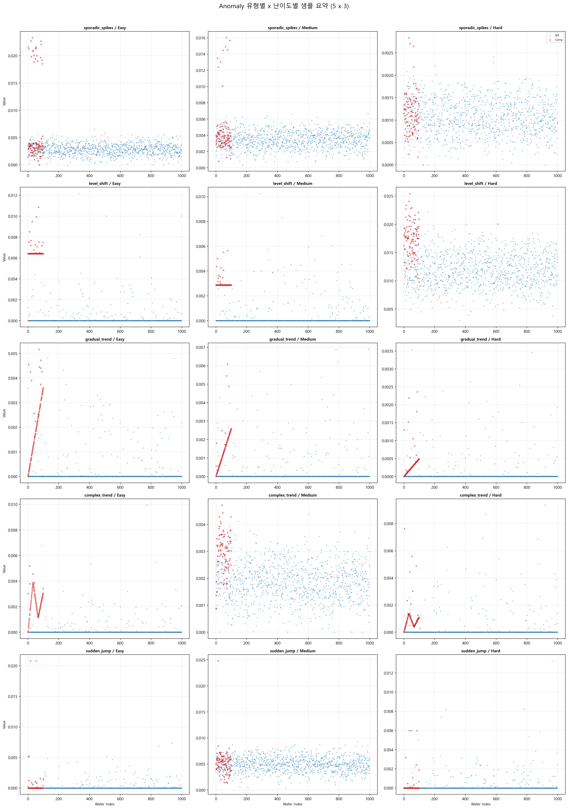
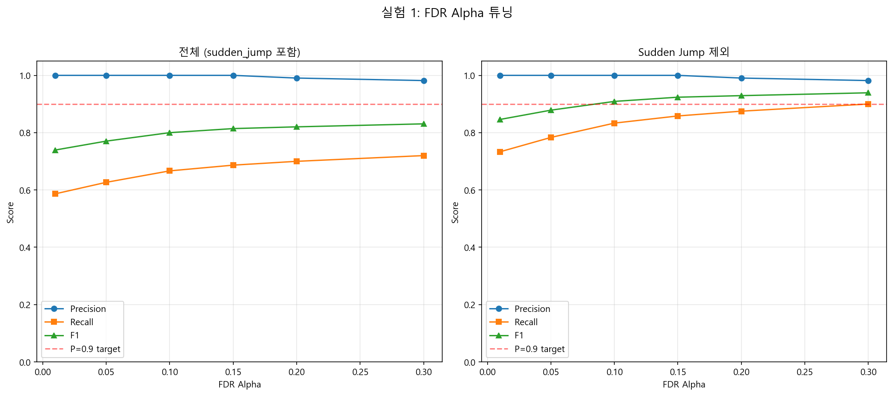
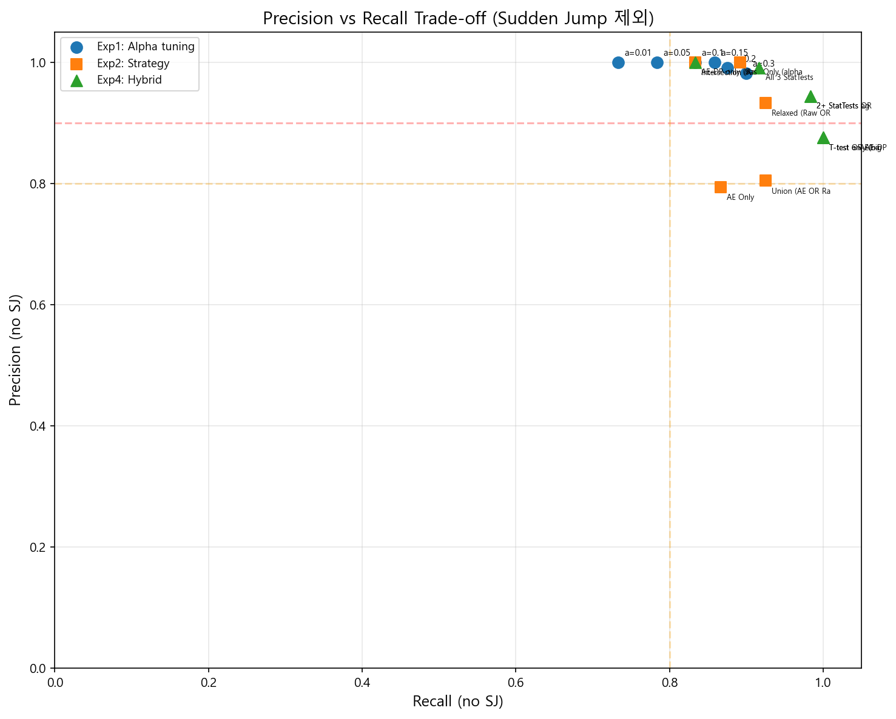
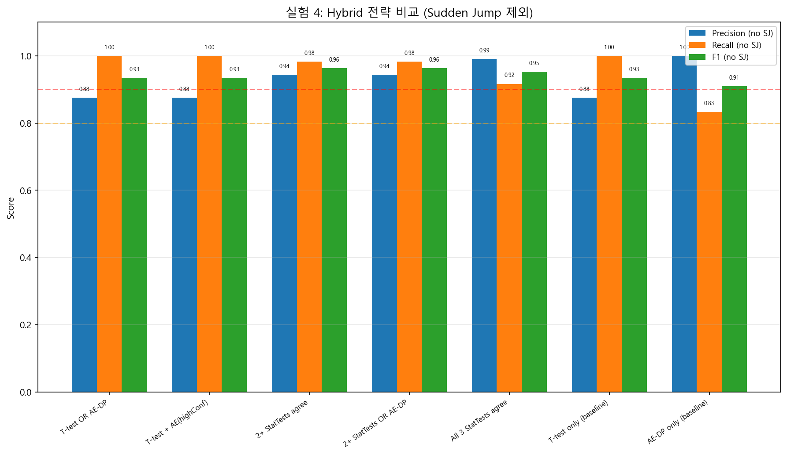

# EDS BIN Feature 유의차 검출 벤치마크

반도체 EDS BIN Item(BIN130~BIN629)에 대해 Ref Group vs Comp Group 간 **유의차가 있는 Feature를 검출**하고, 다양한 탐지 방법의 성능을 정량 비교하는 프로젝트.

---

## 1. 실험 배경

### 1.1 문제 정의

- EDS Item 400~500개 대상 Precision 0.8+ 변경점 분석 모델을 Dashboard로 배포 필요
- BIN 데이터는 대부분 0-skewed 비정규 분포 -> 비모수 검정이 유리
- **목표**: 어떤 Feature가 Ref/Comp 간 유의차를 보이는지 자동 검출

### 1.2 접근 전략

1. **통계검정 즉시 배포**: Mann-Whitney U, KS Test 등 비모수 검정으로 빠르게 서비스
2. **AE Dual-Path Pipeline**: Autoencoder + 통계검정 교차검증으로 FP 억제
3. **벤치마크를 통해 최적 방법론 선정**

---

## 2. 합성 데이터 설명

### 2.1 데이터 구조 (Wafer 기반)

| 항목 | 값 |
|------|-----|
| Ref Group | 1,000 wafers x 500 features |
| Comp Group | 100 wafers x 500 features |
| Feature 범위 | BIN130 ~ BIN629 |
| 정상 Feature | 350개 |
| Anomaly Feature | 150개 (5유형 x 3난이도 x 10개) |

### 2.2 BIN Baseline 유형 (3가지)

| 유형 | 비율 | 특성 |
|------|------|------|
| Zero-heavy | 60% | 90%+ 가 0, 희소한 비영 값 (exponential) |
| Low-rate | 30% | 평균 0.1~0.5% 불량률 |
| Moderate-rate | 10% | 평균 1~3% 만성 불량 |

### 2.3 Anomaly 유형 (5가지)

| 유형 | 설명 |
|------|------|
| Sporadic Spikes | 10~20% wafer에서 큰 스파이크 발생 |
| Level Shift | Comp 전체 wafer의 평균 상승 |
| Gradual Trend | Wafer 순서대로 점진적 증가 |
| Complex Trend | 급상승 -> 정상화 -> 재상승 (3단계) |
| Sudden Jump | 1~3 wafer만 스파이크 후 즉시 정상 |

### 2.4 난이도 (3단계)

| 난이도 | Spike 배수 | Shift 배수 | Trend 배수 |
|--------|-----------|-----------|-----------|
| Easy | 15~20x std | 6~8x std | 4~6x std |
| Medium | 8~12x std | 3~5x std | 2~3x std |
| Hard | 3~5x std | 1.5~2.5x std | 1~1.5x std |

### 2.5 유형별 x 난이도별 샘플 시각화

각 anomaly 유형과 난이도 조합별 샘플을 `docs/sample_views/`에서 확인할 수 있다.



> 개별 상세 차트 (Scatter + Distribution + Box plot): `docs/sample_views/{유형}_{난이도}.png`

---

## 3. 탐지 방법

### 3.1 통계검정 (4종)

| # | 방법 | 특성 |
|---|------|------|
| 1 | Mann-Whitney U | 비모수, rank-based, 0-skewed에 강건 |
| 2 | KS Test | 분포 형태 비교, 가장 빠름 |
| 3 | T-test | 모수적 평균 비교 기준선 |
| 4 | Welch's t-test | 이분산 허용 모수 검정 |

### 3.2 딥러닝 기반 (2종)

| # | 방법 | 특성 |
|---|------|------|
| 5 | Autoencoder | FC-AE reconstruction error, IQR threshold |
| 6 | **AE Dual-Path** | ECO 방법론: AE + 통계검정 교차검증 |

### 3.3 AE Dual-Path Pipeline (ECO 방법론)

```
[Step 1] AE 학습 (Train 800) -> Holdout 200 + Comp 100 에 대한 Feature별 Recon Error
[Step 2] AE Error 통계검정 (Holdout Ref vs Comp) -> 1차 후보
         Mann-Whitney U + KS Test + FDR Correction (BH)
[Step 3] Raw Feature 통계검정 (Ref vs Comp) -> 2차 후보
         Mann-Whitney U + KS Test + FDR Correction (BH)
[Step 4] 교집합 (Cross-Validation) -> 최종 유의 Feature
         AE Error 유의 AND Raw Feature 유의
```

- **교집합 전략**: AE Error와 Raw Feature 양쪽 모두에서 유의한 Feature만 최종 검출
- **FDR Correction**: Benjamini-Hochberg 방법으로 다중검정 보정
- **이중 검증**: AE의 비선형 패턴 탐지 + 통계검정의 해석 가능성을 결합

---

## 4. 실험 결과

### 4.1 전체 성능 요약

| Method | Precision | Recall | F1 | AUC | Time(s) |
|--------|-----------|--------|-----|-----|---------|
| **T-test** | **0.887** | **0.893** | **0.890** | 0.969 | 0.285 |
| **KS Test** | **0.974** | 0.753 | **0.850** | 0.903 | 0.196 |
| **Mann-Whitney U** | **0.915** | 0.787 | **0.846** | 0.890 | 0.251 |
| **Welch's t-test** | **0.823** | 0.807 | **0.815** | 0.929 | 0.251 |
| **AE Dual-Path** | **1.000** | 0.627 | 0.770 | 0.898 | 4.260 |
| **Autoencoder** | **0.972** | 0.460 | 0.624 | 0.929 | 5.054 |

> **Precision 0.8 이상 달성: 6개 방법 전체**

### 4.2 Performance Heatmap


### 4.3 Method Comparison


### 4.4 ROC Curves


### 4.5 Anomaly 유형별 Recall

| Method | level_shift | gradual_trend | complex_trend | sporadic_spikes | sudden_jump |
|--------|:---:|:---:|:---:|:---:|:---:|
| T-test | 1.000 | 1.000 | 1.000 | 1.000 | **0.467** |
| Mann-Whitney U | 1.000 | 1.000 | 1.000 | 0.867 | 0.067 |
| KS Test | 1.000 | 1.000 | 1.000 | 0.733 | 0.033 |
| Welch's t-test | 1.000 | 1.000 | 1.000 | 0.967 | 0.067 |
| AE Dual-Path | 1.000 | 0.867 | 0.933 | 0.333 | 0.000 |
| Autoencoder | 0.767 | 0.200 | 0.300 | 0.667 | 0.367 |


### 4.6 난이도별 Recall


---

## 5. 방법별 유의차 Feature 검출 결과

### 5.1 전체 방법 비교

각 방법이 검출한 Feature를 TP(정확 검출)/FP(오탐)/FN(미탐)/TN(정상)으로 분류하여 시각화한다.


### 5.2 방법 간 검출 일치도

Jaccard Similarity로 방법 간 검출 결과의 유사성을 비교한다.


---

## 6. AE Dual-Path Feature 검출 과정

### 6.1 파이프라인 단계별 결과

| 단계 | 검출 Feature 수 |
|------|:---:|
| Step 2: AE Error 유의 | 125개 |
| Step 3: Raw Feature 유의 | 102개 |
| Step 4: 교집합 (최종) | **94개** |
| AE만 유의 | 31개 |
| Raw만 유의 | 8개 |

### 6.2 Ground Truth 대비 정확도

| 지표 | 값 |
|------|:---:|
| True Positive (정확 검출) | 94 |
| False Positive (오탐) | **0** |
| False Negative (미탐) | 56 |
| **Precision** | **1.000** |
| Recall | 0.627 |

> **FP = 0**: 교집합 전략으로 False Positive를 완전 제거

### 6.3 Dual-Path Pipeline 시각화


- **좌**: AE Error 차이 (Comp - Holdout) - 유의 Feature 표시 (빨간색)
- **중**: Raw Feature KS Statistic - 유의 Feature 표시 (빨간색)
- **우**: 교집합 분류 (AE만 / 교집합 / Raw만)

### 6.4 Feature별 유의차 검출 결과


- **빨간점**: 교집합 (최종 유의) - 94개
- **주황점**: AE만 유의 - 31개
- **보라점**: Raw만 유의 - 8개
- **회색점**: 정상 - 367개
- **검정 원**: Ground Truth Anomaly 위치

### 6.5 Scatter 차트 (유형별 Ref vs Comp)

| Sporadic Spikes | Level Shift |
|:---:|:---:|
|  |  |

| Gradual Trend | Complex Trend |
|:---:|:---:|
|  |  |

| Sudden Jump |
|:---:|
|  |

---

## 7. 계산비용 비교 분석

### 7.1 방법별 계산비용

| Method | Total(s) | Per Feature(ms) | F1 | Precision | Est.1000feat(s) | Est.5000feat(s) | Complexity |
|--------|----------|-----------------|-----|-----------|-----------------|-----------------|------------|
| KS Test | 0.196 | 0.39 | 0.850 | 0.974 | 0.39 | 1.96 | O(n_wafers * n_features) |
| Mann-Whitney U | 0.251 | 0.50 | 0.846 | 0.915 | 0.50 | 2.51 | O(n_wafers * n_features) |
| Welch's t-test | 0.251 | 0.50 | 0.815 | 0.823 | 0.50 | 2.51 | O(n_wafers * n_features) |
| T-test | 0.285 | 0.57 | 0.890 | 0.887 | 0.57 | 2.85 | O(n_wafers * n_features) |
| AE Dual-Path | 4.260 | 8.52 | 0.770 | 1.000 | 11.08 | 85.21 | O(n_wafers * n_features * epochs) |
| Autoencoder | 5.054 | 10.11 | 0.624 | 0.972 | 13.14 | 101.08 | O(n_wafers * n_features * epochs) |

### 7.2 효율성 지표 (F1/sec)

| Method | F1/sec | 평가 |
|--------|--------|------|
| KS Test | 4.34 | 가장 효율적 |
| Mann-Whitney U | 3.37 | 높은 효율 |
| Welch's t-test | 3.25 | 높은 효율 |
| T-test | 3.12 | 높은 효율 |
| AE Dual-Path | 0.18 | 배치 분석용 |
| Autoencoder | 0.12 | 배치 분석용 |

### 7.3 계산비용 vs 성능 Trade-off


### 7.4 실행 시간 비교


### 7.5 계산비용 요약

| 구분 | 통계검정 (4종) | AE 기반 (2종) |
|------|--------------|--------------|
| **평균 처리 시간** | 0.246s | 4.657s |
| **Feature당 처리 시간** | 0.39~0.57ms | 8.52~10.11ms |
| **5000 Feature 추정** | 1.96~2.85s | 85~101s |
| **속도 비율** | 1x (기준) | ~19x 느림 |
| **서비스 적합성** | 실시간 Dashboard | 배치 분석 |
| **확장성** | 선형 증가 | 비선형 증가 |

---

## 8. AE 성능 개선 실험

AE Dual-Path의 Recall을 향상시키기 위해 4가지 실험을 수행했다. Sudden Jump 유형은 1~3 wafer만 변화하는 극단적 특성으로, 분포 기반 방법으로는 구조적으로 탐지가 어려워 별도 평가 기준을 적용했다.

### 8.1 실험 1: FDR Alpha 튜닝

FDR correction의 alpha를 조정하여 검출 민감도를 변화시킨다.

| Alpha | P (all) | R (all) | F1 (all) | P (no SJ) | R (no SJ) | F1 (no SJ) | FP |
|-------|---------|---------|----------|-----------|-----------|------------|-----|
| 0.01 | 1.000 | 0.587 | 0.739 | 1.000 | 0.733 | 0.846 | 0 |
| 0.05 | 1.000 | 0.627 | 0.770 | 1.000 | 0.783 | 0.879 | 0 |
| **0.10** | **1.000** | **0.667** | **0.800** | **1.000** | **0.833** | **0.909** | **0** |
| 0.15 | 1.000 | 0.687 | 0.814 | 1.000 | 0.858 | 0.924 | 0 |
| 0.20 | 0.991 | 0.700 | 0.820 | 0.991 | 0.875 | 0.929 | 1 |
| 0.30 | 0.982 | 0.720 | 0.831 | 0.982 | 0.900 | 0.939 | 2 |

> alpha=0.15까지 FP=0 유지. alpha=0.10 추천 (P=1.000, F1=0.800)



### 8.2 실험 2: 교집합 vs 합집합 전략

| Strategy | P (all) | R (all) | F1 (all) | P (no SJ) | R (no SJ) | F1 (no SJ) | FP |
|----------|---------|---------|----------|-----------|-----------|------------|-----|
| Intersection (AE AND Raw) | 1.000 | 0.667 | 0.800 | 1.000 | 0.833 | 0.909 | 0 |
| **Raw Only (alpha=0.10)** | **1.000** | **0.713** | **0.833** | **1.000** | **0.892** | **0.943** | **0** |
| Relaxed (Raw OR AE+highKS) | 0.933 | 0.747 | 0.830 | 0.933 | 0.925 | 0.929 | 8 |
| Union (AE OR Raw) | 0.811 | 0.773 | 0.792 | 0.804 | 0.925 | 0.860 | 27 |

> Raw Only (alpha=0.10)가 FP=0이면서 F1=0.833 달성, 교집합보다 우수

### 8.3 실험 3: AE 아키텍처 비교

| Architecture | P (all) | R (all) | F1 (all) | Time(s) |
|-------------|---------|---------|----------|---------|
| Shallow [128, 64] | 1.000 | 0.667 | 0.800 | 2.61 |
| Default [256, 128, 64] | 1.000 | 0.667 | 0.800 | 3.64 |
| Deep [512, 256, 128, 64] | 1.000 | 0.647 | 0.785 | 5.62 |
| Wide [512, 256, 128] | 1.000 | 0.647 | 0.785 | 4.99 |
| Narrow [128, 32] | 1.000 | 0.653 | 0.790 | 2.49 |

> AE 아키텍처 변경은 성능에 미미한 영향. Shallow가 가장 빠르면서 동등 성능

### 8.4 실험 4: Hybrid 전략 (통계검정 + AE)

| Strategy | P (all) | R (all) | F1 (all) | P (no SJ) | R (no SJ) | F1 (no SJ) | FP |
|----------|---------|---------|----------|-----------|-----------|------------|-----|
| **2+ StatTests agree** | **0.945** | **0.800** | **0.866** | **0.944** | **0.983** | **0.963** | **7** |
| All 3 StatTests agree | 0.991 | 0.733 | 0.843 | 0.991 | 0.917 | 0.952 | 1 |
| T-test OR AE-DP | 0.887 | 0.893 | 0.890 | 0.876 | 1.000 | 0.934 | 17 |
| T-test only (baseline) | 0.887 | 0.893 | 0.890 | 0.876 | 1.000 | 0.934 | 17 |
| AE-DP only (baseline) | 1.000 | 0.667 | 0.800 | 1.000 | 0.833 | 0.909 | 0 |

> **2+ 통계검정 동의**: sudden_jump 제외 시 P=0.944, R=0.983, **F1=0.963** (최고)

### 8.5 Precision vs Recall Trade-off



### 8.6 Hybrid 전략 비교



### 8.7 개선 실험 요약

| 순위 | 전략 | P (no SJ) | R (no SJ) | F1 (no SJ) | FP |
|------|------|-----------|-----------|------------|-----|
| 1 | **2+ 통계검정 동의** | 0.944 | 0.983 | **0.963** | 7 |
| 2 | All 3 통계검정 동의 | 0.991 | 0.917 | 0.952 | 1 |
| 3 | Raw Only (alpha=0.10) | 1.000 | 0.892 | 0.943 | 0 |
| 4 | AE Dual-Path (alpha=0.30) | 0.982 | 0.900 | 0.939 | 2 |
| 5 | AE Dual-Path (alpha=0.15) | 1.000 | 0.858 | 0.924 | 0 |

---

## 9. 핵심 인사이트

| # | 인사이트 | 상세 |
|---|---------|------|
| 1 | **통계검정이 F1 최고** | T-test (F1=0.890) > KS (0.850) > MW-U (0.846), 즉시 배포 가능 |
| 2 | **AE Dual-Path가 Precision 최고** | P=1.000 (FP=0), 교집합 전략으로 오탐 완전 제거 |
| 3 | **KS Test가 가장 효율적** | 0.196초로 가장 빠르면서 P=0.974, 효율성(F1/sec) 최고 |
| 4 | **Sudden Jump은 구조적 한계** | 1~3 wafer만 변화 -> 분포 비교로는 탐지 어려움, 별도 접근 필요 |
| 5 | **통계검정은 난이도에 robust** | Easy~Hard 간 Recall 차이가 작아 안정적 |
| 6 | **AE 아키텍처는 성능에 미미** | 교집합 전략이 최종 성능을 지배, AE 구조 변경 효과 작음 |
| 7 | **2+ 통계검정 동의가 최적** | SJ 제외 시 F1=0.963, P=0.944로 가장 균형잡힌 전략 |
| 8 | **통계검정은 AE 대비 ~19배 빠름** | 실시간 Dashboard 배포에 적합, AE는 배치 분석에 적합 |

---

## 10. 배포 전략 권고

```
[즉시 배포 - 실시간 Dashboard]
+-- Primary: 2+ 통계검정 동의 (F1=0.866, P=0.945)
|   -> T-test + KS + MW-U 중 2개 이상 유의 시 검출
|   -> sudden_jump 제외 시 F1=0.963
+-- Alternative: T-test 단독 (F1=0.890, 가장 간단)
|   -> 구현 단순, 0.285초로 빠름

[Precision 극대화 - 배치 분석]
+-- AE Dual-Path (alpha=0.15): P=1.000, FP=0, R=0.687
|   -> 오탐 허용 불가 시 사용
+-- All 3 StatTests agree: P=0.991, FP=1
|   -> AE 없이 높은 Precision 달성 가능

[후속 개선]
+-- Sudden Jump 전용 탐지기 (이상치 탐지 방법 별도 적용)
+-- 실 데이터 검증 후 alpha/전략 미세 조정
```

---

## 11. 실행 방법

```bash
# 의존성 설치
pip install -r requirements.txt

# 벤치마크 실행 (6가지 방법, ~15초)
python run_benchmark.py

# 샘플 시각화 생성 (유형별 x 난이도별 15개 차트)
python generate_samples.py

# AE 성능 개선 실험 (4가지 실험, ~2분)
python experiment_ae_improvement.py

# 테스트 (33/33 통과)
pytest tests/ -v
```

---

## 12. Project Structure

```
chage_point_detection/
+-- src/
|   +-- data_generation.py          # 합성 BIN 데이터 생성기 (Wafer 기반)
|   +-- dual_path_pipeline.py       # AE Dual-Path Pipeline (ECO 방법론)
|   +-- evaluation.py               # 벤치마크 평가 프레임워크
|   +-- benchmark_visualization.py  # 벤치마크 시각화 (Scatter + Feature 검출 + 계산비용)
|   +-- preprocessing.py            # 데이터 전처리
|   +-- visualization.py            # 기본 시각화
|   +-- detectors/                  # 변경점 탐지 방법 패키지
|       +-- base.py                 #   추상 베이스 클래스 (Wafer 기반)
|       +-- statistical.py          #   Mann-Whitney, KS, T-test, Welch
|       +-- autoencoder.py          #   FC-AE 탐지기
+-- tests/
|   +-- test_data_generation.py     # 데이터 생성 테스트
|   +-- test_detectors.py           # 탐지기 테스트
+-- docs/
|   +-- benchmark_results/          # 벤치마크 결과 이미지/CSV
|   +-- sample_views/               # 유형별 x 난이도별 샘플 시각화 (15개 + 요약)
|   +-- ae_improvement/             # AE 성능 개선 실험 결과
+-- run_benchmark.py                # 벤치마크 실행 스크립트
+-- generate_samples.py             # 샘플 시각화 생성 스크립트
+-- experiment_ae_improvement.py    # AE 성능 개선 실험 스크립트
+-- requirements.txt
+-- README.md
```

---

## 13. Usage

```python
from src.data_generation import BINDataGenerator
from src.dual_path_pipeline import DualPathPipeline

# 1. 데이터 생성 (또는 실제 데이터 로드)
gen = BINDataGenerator(n_ref=1000, n_comp=100, n_features=500)
dataset = gen.generate()

# 2. AE Dual-Path Pipeline 실행
pipeline = DualPathPipeline(
    hidden_dims=[256, 128, 64],
    epochs=100,
    alpha=0.05,
    fdr_method="fdr_bh",
)
result = pipeline.run(dataset.ref_data, dataset.comp_data, dataset.feature_names)

# 3. 결과 확인
print(f"AE Error 유의: {result.n_ae_significant}개")
print(f"Raw Feature 유의: {result.n_raw_significant}개")
print(f"교집합 (최종): {result.n_intersection}개")

# 4. 유의 Feature 목록
import numpy as np
sig_indices = np.where(result.intersection)[0]
for idx in sig_indices:
    print(f"  {dataset.feature_names[idx]}: KS={result.raw_ks_statistics[idx]:.4f}")
```

---

## 14. References

1. Hotelling, H. (1947). "Multivariate Quality Control." *Techniques of Statistical Analysis*, McGraw-Hill.
2. Jackson, J.E. & Mudholkar, G.S. (1979). "Control Procedures for Residuals Associated with PCA." *Technometrics*, 21(3).
3. Benjamini, Y. & Hochberg, Y. (1995). "Controlling the False Discovery Rate." *JRSS Series B*, 57(1), 289-300.
4. Mann, H.B. & Whitney, D.R. (1947). "On a Test of Whether One of Two Random Variables is Stochastically Larger." *Annals of Mathematical Statistics*, 18(1), 50-60.
